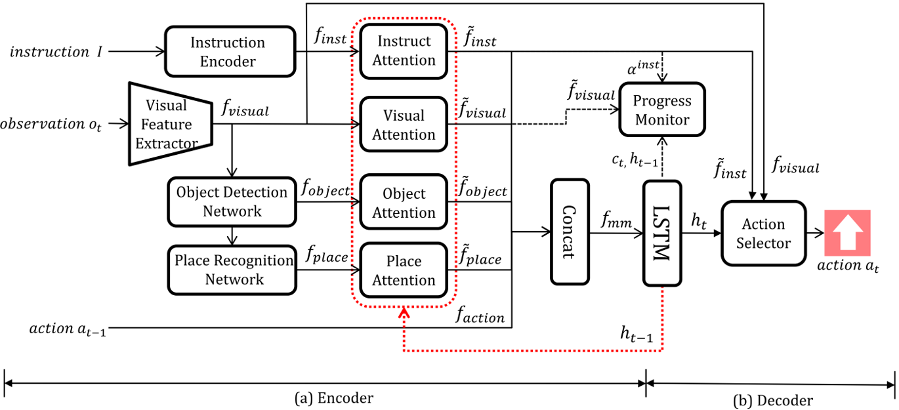

# LandmarkVLN
[LVLN : A Landmark-Based Deep Neural Network Model for Vision-and-Language Navigation](http://kiss.kstudy.com/thesis/thesis-view.asp?key=3703348)-2019.09, Journal of KIPS(KTSDE)   

  
